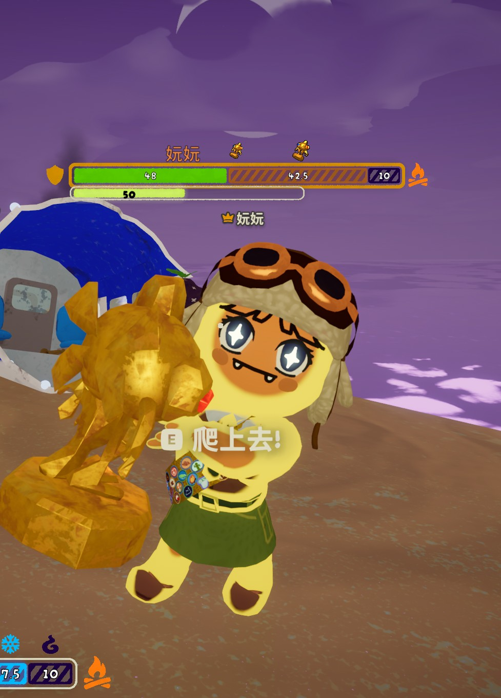
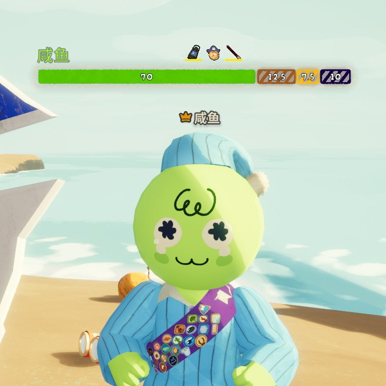

# Peak Overhead Stats

Teammate stamina bars moved **above players heads** — all stats and UI based on **PeakStatsEx**, with the party panel repositioned overhead.

Based on [PeakStatsEx](https://thunderstore.io/c/peak/p/LengSword/PeakStatsEx/) by LengSword, with overhead positioning inspired by OverheadStamina.

## Screenshots

## Features

### Overhead teammate display
Everything PeakStatsEx showed in the bottom-left party list now floats above each teammate:

- **Player name** — colored by player cosmetics
- **Main stamina bar** — green fill with numeric value
- **Weight bar** — orange segment for carry/load
- **Affliction bars** — petrify (purple), curse (fire icon), cold, hunger, and all other status types
- **Extra stamina bar** — light green bar below the main bar
- **Inventory slots** — held items shown next to the name

### Stats HUD (screen top)
- **Climb timer** — total elapsed time
- **Height / distance** — current altitude and climb progress
- **Day/night countdown** — time until next day/night cycle
- **Fog stats** — current fog level
- **Lava / kiln stats** — rising hazard levels

### Map HUD (screen top-right)
- **Map route** — biome progression bar (Coast · Rainforest · Mesa · Fog Swamp · Citadel · Peak)
- **Current level / biomes** — localized names (from PeakStatsEx)
- **Map seed** — when using a supported map generation mod

### Self stamina bar numbers
Adds numeric values to the game own stamina bar (current stamina, extra stamina, affliction countdowns) — same as PeakStatsEx StaminaInfo.

## Configuration

Edit `BepInEx/config/com.yls.peakoverheadstats.cfg` after launching once:

| Section | Setting | Default | Description |
|---|---|---|---|
| General | Display Teammate Stamina Bars | true | Show overhead teammate bars |
| General | Teammate Stamina Bar Proximity | 30 | Max distance to see bars |
| General | Teammate Stamina Bar Limit | 4 | Max visible bars |
| General | Teammate Stamina Bar Scale | 0.72 | Bar scale multiplier |
| General | Show Inventory Slots | true | Show teammate inventory |
| General | Show Stamina Info | true | Show numeric values on bars |
| Stats | Display Timer / Height / Level / Biomes | true | Individual HUD toggles |
| Stats | Display Day Night Countdown | true | Day/night cycle timer |
| Stats | Display Fog Stats / Lava Stats | true | Hazard level displays |
| Stats | Display Map Seed | true | Map seed display |

## Installation

1. Install **BepInExPack for PEAK**
2. Place `PeakOverheadStats.dll` in `BepInEx/plugins/`
3. Launch the game

## Credits & Acknowledgements

- **PeakStatsEx** by LengSword — base stats HUD and UI (Codeberg: yls-peak-mods/PeakStatsEx)
- **OverheadStamina** by PatchNote — overhead positioning reference
- **妧妧** — playtesting and feedback
- **咸鱼** — playtesting and feedback
